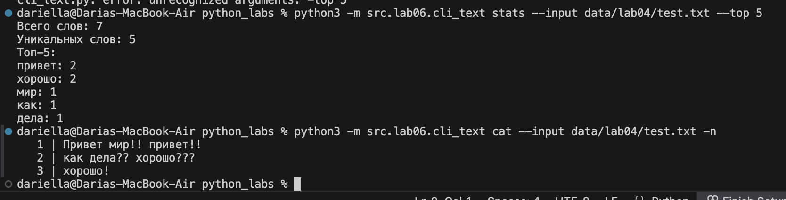
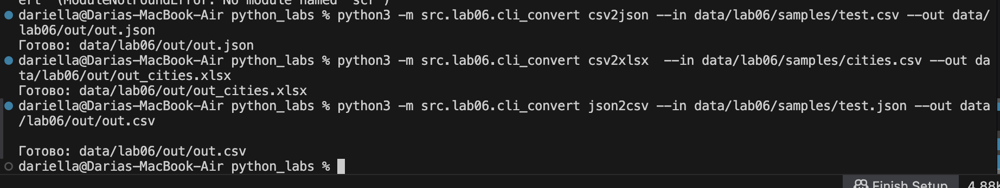
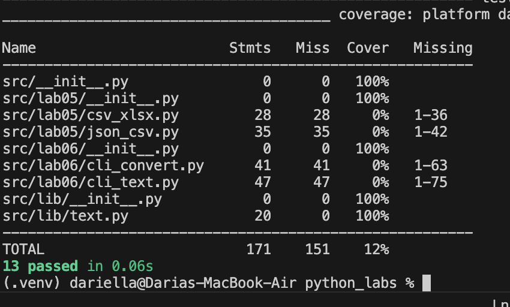
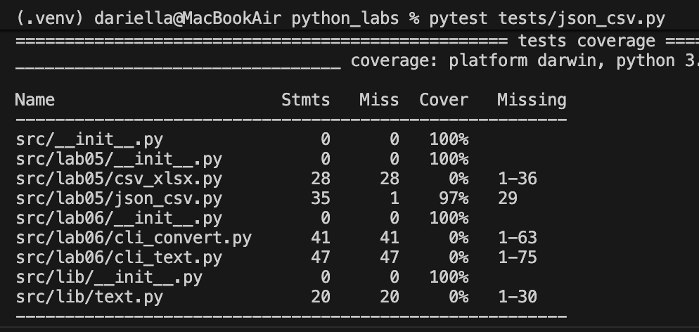
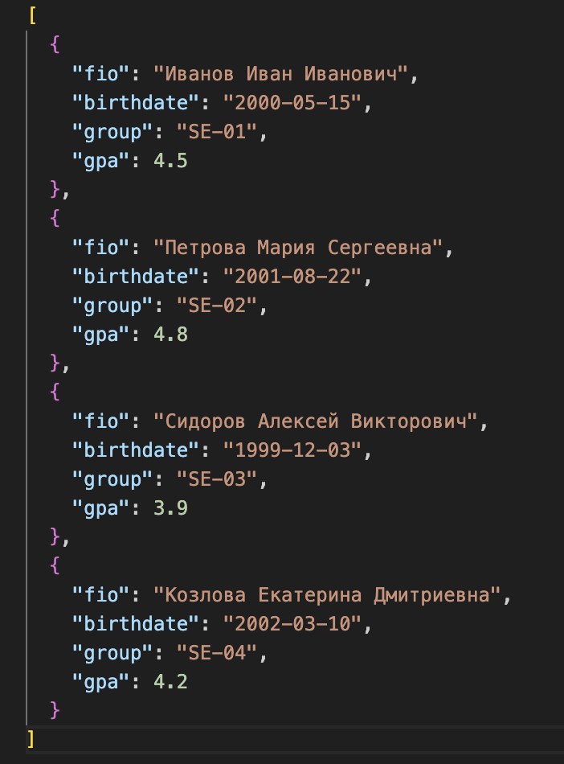
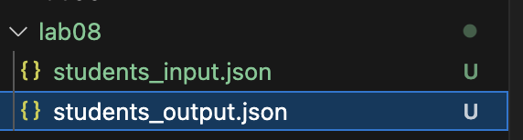

# Лабораторная работа 1 
## Задание 1

``` name=input('Имя:')
age=int(input('Возраст:'))
print(f'Привет,{name}! Через год тебе будет {age+1}!') 
```

## Задание 2

``` a=float(input('1 число').replace(',','.'))
b=float(input('2 число').replace(',','.'))
sum=a+b
avg=sum/2
print(f'sum={sum:.2f},avg={avg:.2f}')

```

## Задание 3

``` price=float(input('цена'))
discount=float(input('скидка'))
vat=float(input('налог'))
base = price * (1 - discount/100)
vat_amount = (base * (vat/100))
total = (base + vat_amount)
print(f'База после скидки:{base:.2f}')
print(f'НДС:{vat_amount:.2f}')
print(f'И того с оплате:{total:.2f}')
```

## Задание 4

``` min=int(input('Минуты:'))
hour=min//60
mins=min%60
print(f'{hour}:{mins}')
```

## Задание 5

```name=input("ФИО: ")
inc=''
len_name=0
name_list=[]
for i in name.split():
    inc+=(i)[0]
    name_list.append(i)
for i in name_list:
    len_name= len_name+len(i)+1


print(f'Инициалы:{inc}')
print(f'Длина строки: {len_name-1}')
```


# Лабораторная работа 2
## Задание 1

```
from  itertools import *
def min_max(nums: list[float | int]) -> tuple[float | int, float | int]:
    if not nums:
        raise ValueError('ValueError')
    return (min(nums), max(nums))

def  unique_sorted(nums: list[float | int]) -> list[float | int]:
    return list(sorted(set(nums)))

def flatten(mat: list[list | tuple]) -> list:
    for i in mat:
        if type(i) == str:
            return TypeError('TypeError')
        if len(i)==0:
            del(i)
    return list(chain(*mat))


print(min_max([1.5, 2, 2.0, -3.1]))
print(unique_sorted([1,4,1,1,-6,-6,0.8]))
print(flatten([[1,4,1,1],[-6,-6,0.8]]))
```

## Задание B

```
def transpose(mat: list[list[float | int]]) -> list[list]:
    if len(mat)>1:
        for lines in range(1,len(mat)):
            if len(mat[0])!=len(mat[lines]):
                ans = 'ValueError'
            else: ans = [list(row) for row in zip(*mat)]
    else: ans = [list(row) for row in zip(*mat)]
    return ans
print(transpose([[1, 2, 3]] ))

def row_sums(mat: list[list[float | int]]) -> list[float]:
    ans=[]
    if len(mat)>1:
        for lines in range(1,len(mat)):
            if len(mat[0])!=len(mat[lines]):
                ans = 'ValueError'
            else:
                for lines in range(len(mat)):
                    ans.append(sum(mat[lines]))
    return ans
print(row_sums([[-1, 1], [10, -10]]))

def col_sums(mat: list[list[float | int]]) -> list[float]:
    ans=[]
    for lines in range(len(mat)):
        if len(mat[0])!=len(mat[lines]):
            raise 'ValueError'
            break
    for colums in range(len(mat[0])):
        sum = 0
        for lines in range(len(mat)):
                    sum += mat[lines][colums]
        ans.append(sum)
    return ans

print(col_sums([[1, 2, 3], [4, 5, 6]]))

```

## Задание C

```
def format_record(rec: tuple[str, str, float]) -> str:

    for date in range(len(rec)):
        if len(str(rec[date])) == 0 or len(rec)!=3:
            raise 'ValueError'
    fin_name=[]
    for inc in rec[0].split():
        fin_name.append(inc.title())
    fin_name_st=f'{fin_name[0]} '
    sur_name_st=''
    for n in range(1,len(fin_name)):
        sur_name_st+=f'{fin_name[n][0]}.'
    if float(rec[2])>5.0:
        raise 'ValueError'
    gpa=float(rec[2])
    group=rec[1].strip()
    return f'{fin_name_st+ sur_name_st}, гр. {group}, GPA {gpa:.2f}'

print(format_record(("  сидорова  анна   сергеевна ", "ABB-01", 3.999)))
```


# Лабораторная работа 3 
## Цель работы
Нормализовать текст, аккуратно токенизировать, посчитать частоты слов и вывести топ-N слов.

## Задание A

``` 
import re

pattern = r'\w+(?:-\w+)*'
def normalize(text: str, *, casefold: bool = True, yo2e: bool = True) -> str:
    if casefold: text = text.lower()
    if yo2e: text = text.replace("ё","е")
    #text = re.findall(pattern, text)
    result = re.sub(r'\s+', ' ', text).strip()

    return result

print(normalize("ПрИвЕт\nМИр\t"))

def tokenize(text: str) -> list[str]:
    text=normalize(text)
    return re.findall(pattern, text)

print(tokenize("emoji 😀 не слово"))

def count_freq(tokens: list[str]) -> dict[str, int]:
    counts: dict[str, int] = {}
    for token in tokens:
        counts[token] = counts.get(token, 0) + 1
    return counts
print(count_freq(["a","b","b","b","a","c","b","a"]))

def top_n(freq: dict[str, int], n: int = 5) -> list[tuple[str, int]]:
    return sorted(freq.items(), key=lambda x: x[1], reverse=True)[:n]
print(top_n(count_freq(["a","b","a","c","b","a"]),n=5))
```

## Задание B

```
import sys
import os


sys.path.append(os.path.join(os.path.dirname(__file__), '..', 'lib'))

from text import normalize, top_n,tokenize, count_freq

inf=input("")
print(f'Всего слов: {len(tokenize(inf))}')
print(f'Уникальных слов: {len(count_freq((tokenize(inf))))}')
print('Топ-5:')
for world,count in top_n(count_freq((tokenize(inf))))[:5]:
     print(f'{world}: {count}')

```


# Лабораторная работа 4 
## Цель работы
закрепить работу с файлами (чтение/запись, кодировки), автоматизировать сбор статистики по словам и выгружать её в CSV.

## Задание A

``` 
from pathlib import Path
import csv
from typing import Iterable, Sequence
import sys
import os
sys.path.append(os.path.join(os.path.dirname(__file__), '..', 'lib'))
from text import normalize, tokenize
def read_text(path: str | Path, encoding: str = "utf-8") -> str:
    path = Path(path)
    try:
         open(path, encoding=encoding)
    except UnicodeDecodeError:
        print("UnicodeDecodeError")
    except FileNotFoundError:
        print("FileNotFoundError")
    return path.read_text(encoding=encoding)
    raise UnicodeDecodeError
    raise FileNotFoundError

def write_csv(rows: Iterable[Sequence], path: str | Path,
              header: tuple[str, ...] | None = None) -> None:
    p = Path(path)
    rows = list(rows)

    with p.open("w", newline="", encoding="utf-8") as f:
        w = csv.writer(f)
        if rows:
            first_len = len(rows[0])
            for i, row in enumerate(rows):
                if len(row) != first_len:
                    raise ValueError
        if header is not None:
            w.writerow(header)
        for r in rows:
            w.writerow(r)

from collections import Counter

def frequencies_from_text(text: str) -> dict[str, int]:
    from lib.text import normalize, tokenize  # из ЛР3
    tokens = tokenize(normalize(text))
    return Counter(tokens)  # dict-like

def sorted_word_counts(freq: dict[str, int]) -> list[tuple[str, int]]:
    return sorted(freq.items(), key=lambda kv: (-kv[1], kv[0]))

```


## Задание B

```
import sys
import os

from src.lib.text import top_n

sys.path.append(os.path.join(os.path.dirname(__file__), '..', 'lib'))
sys.path.append(os.path.join(os.path.dirname(__file__), '..', '..'))
from io_txt_csv import read_text, write_csv, frequencies_from_text
from text import normalize, top_n,tokenize, count_freq

txt = read_text("/Users/dariella/Desktop/python_labs/data/lab04/test.txt")
norm=normalize(txt)
token=tokenize(norm)
counts=count_freq(token)
top=top_n(counts)


write_csv( top, "/Users/dariella/Desktop/python_labs/data/lab04/check2.csv",header=("word", "count"))

print(f"Всего слов: {len(token)}")
print(f'Уникальных слов:{len(counts)}')
print('Топ-5:')
for world,count in top[:5]:
     print(f'{world}: {count}')

```


# Лабораторная работа 5 
## Цель работы
Разобраться с форматом JSON, сериализацией/десериализацией и табличными конвертациями.

## Задание A

```python
from pathlib import Path
import json, csv

def json_to_csv(json_path: str, csv_path: str) -> None:
    if not json_path.lower().endswith(".json"):
        raise ValueError("ValueError")
    if not csv_path.lower().endswith(".csv"):
        raise ValueError("ValueError")
    path = Path(json_path)
    if not path.exists():
        raise FileNotFoundError("FileNotFoundError")
    with path.open(encoding="utf-8") as f:
        data = json.load(f)
    if not isinstance(data, list) or not all(isinstance(i, dict) for i in data):
        raise ValueError("ValueError")
    output = Path(csv_path)
    with output.open("w", encoding="utf-8", newline="") as f:
        writer = csv.DictWriter(f, fieldnames=data[0].keys()) #возвращает порядок ключей из первого словаря.
        writer.writeheader()
        writer.writerows(data)


json_to_csv("/Users/dariella/Desktop/python_labs/data/lab05/samples/test.json","/Users/dariella/Desktop/python_labs/data/lab05/out/rr.csv")

def csv_to_json(csv_path: str, json_path: str) -> None:
    if not json_path.lower().endswith(".json"):
        raise ValueError("ValueError")
    if not csv_path.lower().endswith(".csv"):
        raise ValueError("ValueError")
    path = Path(csv_path)
    if not path.exists():
        raise FileNotFoundError("FileNotFoundError")
    with path.open(encoding="utf-8") as f:
        reader = csv.DictReader(f)
        data = list(reader)

    output = Path(json_path)

    with output.open("w", encoding="utf-8") as f:
        json.dump(data, f, ensure_ascii=False, indent=4)

csv_to_json('/Users/dariella/Desktop/python_labs/data/lab05/samples/test.csv', "/Users/dariella/Desktop/python_labs/data/lab05/out/test_from_csv.json")


```


## Задание B

```python
from openpyxl import Workbook
import csv
from pathlib import Path

def csv_to_xlsx(csv_path: str, xlsx_path: str) -> None:
    if not csv_path.lower().endswith(".csv"):
        raise ValueError("ValueError")
    if not xlsx_path.lower().endswith(".xlsx"):
        raise ValueError("ValueError")
    path = Path(csv_path)
    if not path.exists():
        raise FileNotFoundError("FileNotFoundError")
    wb = Workbook()
    ws = wb.active
    ws.title = "Sheet1"
    rows_added = 0
    try:
        with path.open(encoding="utf-8") as f:
            reader = csv.reader(f)
            for row in reader:
                ws.append(row)
                rows_added += 1
    except UnicodeDecodeError:
        raise ValueError("ValueError")

    if rows_added == 0:
        raise ValueError("ValueError")


    output = Path(xlsx_path)


    wb.save(output)


csv_to_xlsx("/Users/dariella/Desktop/python_labs/data/lab05/samples/cities.csv","/Users/dariella/Desktop/python_labs/data/lab05/out/test_from_csv.xlsx")

```


# Лабораторная работа 6 
## Цель работы
Научиться создавать консольные инструменты с аргументами командной строки, подкомандами и флагами.
## Задание 1

```python
import argparse
from pathlib import Path
import sys
import os


sys.path.append(os.path.join(os.path.dirname(__file__), '..', 'lib'))

from text import tokenize, count_freq, top_n


def command_cat(path: Path, number_lines: bool):
    """Вывод файла построчно."""
    with path.open("r", encoding="utf-8") as f:
        for i, line in enumerate(f, 1):
            line = line.rstrip("\n")
            if number_lines:
                print(f"{i:4d} | {line}")
            else:
                print(line)


def command_stats(path: Path, top_n_value: int):
    """Анализ частот слов."""
    text = path.read_text(encoding="utf-8")
    tokens = tokenize(text)
    freq = count_freq(tokens)
    top = top_n(freq, top_n_value)

    print(f"Всего слов: {len(tokens)}")
    print(f"Уникальных слов: {len(freq)}")
    print(f"Топ-{top_n_value}:")
    for word, count in top:
        print(f"{word}: {count}")


def main():
    parser = argparse.ArgumentParser(description="CLI-утилиты лабораторной №6")
    subparsers = parser.add_subparsers(dest="command", help="Подкоманда (cat или stats)")

    # cat
    cat_parser = subparsers.add_parser("cat", help="Вывести содержимое файла")
    cat_parser.add_argument("--input", required=True, help="Путь к файлу")
    cat_parser.add_argument("-n", action="store_true", help="Нумеровать строки")

    # stats
    stats_parser = subparsers.add_parser("stats", help="Частоты слов")
    stats_parser.add_argument("--input", required=True, help="Путь к текстовому файлу")
    stats_parser.add_argument("--top", type=int, default=5, help="Кол-во топ слов (положительное число)")

    args = parser.parse_args()

  
    if args.command is None:
        parser.error("Не указана подкоманда. Используйте одну из: cat, stats")

    
    input_path = Path(args.input)
    if not input_path.exists():
        parser.error(f"Входной файл не найден: {args.input}")

    if args.command == "cat":
        command_cat(input_path, args.n)

    elif args.command == "stats":
        if args.top is None or args.top <= 0:
            parser.error("--top должно быть положительным целым числом")
        command_stats(input_path, args.top)

    else:
        parser.error(f"Неизвестная команда: {args.command}")


if __name__ == "__main__":
    main()


```


## Задание 2

```python
import argparse
from pathlib import Path

from src.lab05.json_csv import json_to_csv, csv_to_json
from src.lab05.csv_xlsx import csv_to_xlsx


def validate_input_file(path: str, parser, expected_ext: str):
    p = Path(path)
    if not p.exists():
        parser.error(f"Файл не найден: {path}")

    if not p.suffix.lower() == expected_ext:
        parser.error(f"Ожидался файл формата {expected_ext}, получено: {p.suffix}")

    return p


def main():
    parser = argparse.ArgumentParser(description="Конвертеры данных")
    sub = parser.add_subparsers(dest="cmd")

    # json → csv
    p1 = sub.add_parser("json2csv", help="Конвертация JSON → CSV")
    p1.add_argument("--in", dest="input", required=True)
    p1.add_argument("--out", dest="output", required=True)

    # csv → json
    p2 = sub.add_parser("csv2json", help="Конвертация CSV → JSON")
    p2.add_argument("--in", dest="input", required=True)
    p2.add_argument("--out", dest="output", required=True)

    # csv → xlsx
    p3 = sub.add_parser("csv2xlsx", help="Конвертация CSV → XLSX")
    p3.add_argument("--in", dest="input", required=True)
    p3.add_argument("--out", dest="output", required=True)

    args = parser.parse_args()

    if args.cmd is None:
        parser.error("Не указана команда. Используйте: json2csv, csv2json, csv2xlsx")

    if args.cmd == "json2csv":
        validate_input_file(args.input, parser, ".json")
        json_to_csv(args.input, args.output)
        print(f"Готово: {args.output}")

    elif args.cmd == "csv2json":
        validate_input_file(args.input, parser, ".csv")
        csv_to_json(args.input, args.output)
        print(f"Готово: {args.output}")

    elif args.cmd == "csv2xlsx":
        validate_input_file(args.input, parser, ".csv")
        csv_to_xlsx(args.input, args.output)
        print(f"Готово: {args.output}")

    else:
        parser.error(f"Неизвестная команда: {args.cmd}")


if __name__ == "__main__":
    main()


```



# Лабораторная работа 7
## Цель работы
научиться писать модульные тесты на pytest, измерять покрытие и поддерживать единый стиль кода (black).
## Задание A

```python

import pytest
from src.lib.text import normalize, tokenize, count_freq, top_n


@pytest.mark.parametrize(
    "source, expected",
    [
        ("ПрИвЕт\\nМИр\\t", "привет мир"),
        ("ёжик, Ёлка", "ежик, елка"),
        ("Hello\\r\\nWorld", "hello world"),
        ("  двойные   пробелы  ", "двойные пробелы"),
    ],
)
def test_normalize_basic(source, expected):
    assert normalize(source) == expected


@pytest.mark.parametrize(
    "source, expected",
    [
        ("привет мир", ["привет", "мир"]),
        ("по-настоящему круто", ["по-настоящему", "круто"]),
        ("hello world", ["hello", "world"]),
        ("2025 год", ["2025", "год"]),
        ("emoji 😀 не слово", ["emoji", "не", "слово"]),
    ],
)
def test_tokenize_basic(source, expected):
    assert tokenize(source) == expected


@pytest.mark.parametrize(
    "source, expected",
    [
        (["a", "b", "a", "c", "b", "a"], [("a", 3), ("b", 2), ("c", 1)]),
        (["bb", "aa", "bb", "aa", "cc"], [("aa", 2), ("bb", 2), ("cc", 1)]),
    ],
)
def test_count_freq_and_top_n(source, expected):
    assert top_n(count_freq(source)) == expected


@pytest.mark.parametrize(
    "source, count, expected",
    [
        ({"a": 3, "b": 2, "c": 1}, 2, [("a", 3), ("b", 2)]),
        ({"aa": 2, "bb": 2, "cc": 1}, 1, [("aa", 2)]),
    ],
)
def test_top_n_tie_breaker(source, count, expected):
    assert top_n(source, count) == expected


```


## Задание B

```python
import pytest
import json
import csv
from pathlib import Path
from src.lab05.json_csv import json_to_csv, csv_to_json


# json_csv


@pytest.mark.parametrize(
    "filename, content",
    [
        ("empty.json", ""),
        ("null.json", "null"),
        ("string.json", '"text"'),
        ("number.json", "42"),
    ],
)
def test_json_to_csv_invalid_types(tmp_path, filename, content):
    src = tmp_path / filename
    dst = tmp_path / "output.csv"

    src.write_text(content, encoding="utf-8")

    with pytest.raises((ValueError, json.JSONDecodeError)):
        json_to_csv(str(src), str(dst))


@pytest.mark.parametrize(
    "filename, content",
    [
        ("malformed.json", '{"name": "Alice",}'),
        ("unclosed.json", '{"name": "Alice"'),
        ("unquoted.json", '{name: "Alice"}'),
        ("broken.json", '[{"name": "Alice]'),
    ],
)
def test_json_to_csv_malformed_json(tmp_path, filename, content):
    src = tmp_path / filename
    dst = tmp_path / "output.csv"

    src.write_text(content, encoding="utf-8")

    with pytest.raises(json.JSONDecodeError):
        json_to_csv(str(src), str(dst))


@pytest.mark.parametrize(
    "filename",
    [
        "nonexistent.json",
        "missing.json",
        "not_found.json",
    ],
)
def test_json_to_csv_file_not_found(tmp_path, filename):
    dst = tmp_path / "output.csv"

    with pytest.raises(FileNotFoundError):
        json_to_csv(str(tmp_path / filename), str(dst))


@pytest.mark.parametrize(
    "json_data, expected_rows",
    [
        ([{"name": "Alice", "age": 25}], 1),
        ([{"name": "Alice"}, {"name": "Bob"}], 2),  # одинаковые ключи
        ([{"id": 1}, {"id": 2}, {"id": 3}], 3),
    ],
)
def test_json_to_csv_valid_data(tmp_path, json_data, expected_rows):
    src = tmp_path / "test.json"
    dst = tmp_path / "test.csv"

    src.write_text(json.dumps(json_data), encoding="utf-8")

    json_to_csv(str(src), str(dst))

    with dst.open(encoding="utf-8") as f:
        reader = csv.DictReader(f)
        rows = list(reader)

    assert len(rows) == expected_rows


# csv_json


@pytest.mark.parametrize(
    "filename, content, expected_count",
    [
        ("empty.csv", "", 0),  # создает пустой массив
        ("whitespace.csv", "   ", 0),
        ("only_newlines.csv", "\n\n\n", 0),
        ("only_header.csv", "name,age", 0),
    ],
)
def test_csv_to_json_empty_csv(tmp_path, filename, content, expected_count):
    src = tmp_path / filename
    dst = tmp_path / "output.json"

    src.write_text(content, encoding="utf-8")

    csv_to_json(str(src), str(dst))

    with dst.open(encoding="utf-8") as f:
        result = json.load(f)

    assert len(result) == expected_count


@pytest.mark.parametrize(
    "filename, content, expected_count",
    [
        ("normal.csv", "name,age\nAlice,22\nBob,25", 2),
        (
            "inconsistent.csv",
            "name,age\nAlice,22\nBob",
            2,
        ),  # обрабатывает неконсистентные данные
        ("quotes.csv", 'name,desc\n"John, Doe",test', 1),
    ],
)
def test_csv_to_json_various_formats(tmp_path, filename, content, expected_count):
    src = tmp_path / filename
    dst = tmp_path / "output.json"

    src.write_text(content, encoding="utf-8")

    csv_to_json(str(src), str(dst))

    with dst.open(encoding="utf-8") as f:
        result = json.load(f)

    assert len(result) == expected_count


@pytest.mark.parametrize(
    "filename",
    [
        "nonexistent.csv",
        "missing.csv",
        "not_found.csv",
    ],
)
def test_csv_to_json_file_not_found(tmp_path, filename):
    dst = tmp_path / "output.json"

    with pytest.raises(FileNotFoundError):
        csv_to_json(str(tmp_path / filename), str(dst))


# same


@pytest.mark.parametrize(
    "func, input_ext",
    [
        (json_to_csv, "json"),
        (csv_to_json, "csv"),
    ],
)
def test_both_functions_none_paths(func, input_ext):
    with pytest.raises(AttributeError):  # AttributeError
        func(None, "output")


@pytest.mark.parametrize(
    "func, input_ext",
    [
        (json_to_csv, "json"),
        (csv_to_json, "csv"),
    ],
)
def test_both_functions_empty_paths(func, input_ext, tmp_path):
    src = tmp_path / f"test.{input_ext}"

    if input_ext == "json":
        src.write_text('[{"test": "data"}]', encoding="utf-8")
    else:
        src.write_text("test\ndata", encoding="utf-8")

    with pytest.raises(ValueError):
        func("", str(tmp_path / "output"))


@pytest.mark.parametrize(
    "func, input_ext, output_ext",
    [
        (json_to_csv, "json", "csv"),
        (csv_to_json, "csv", "json"),
    ],
)
def test_both_functions_simple_paths(tmp_path, func, input_ext, output_ext):
    src = tmp_path / f"test.{input_ext}"
    dst = tmp_path / f"output.{output_ext}"

    if input_ext == "json":
        src.write_text('[{"name": "Test"}]', encoding="utf-8")
    else:
        src.write_text("name\nTest", encoding="utf-8")

    # простые пути в текущей

    func(str(src.name), str(dst.name))

    assert dst.exists()


@pytest.mark.parametrize(
    "func, input_ext, test_data",
    [
        (json_to_csv, "json", '[{"name": "Алиса", "city": "Москва"}]'),
        (csv_to_json, "csv", "name,city\nАлиса,Москва"),
    ],
)
def test_both_functions_utf8_support(tmp_path, func, input_ext, test_data):
    src = tmp_path / f"test.{input_ext}"
    dst = tmp_path / f"output.{'csv' if input_ext == 'json' else 'json'}"

    src.write_text(test_data, encoding="utf-8")

    func(str(src), str(dst))

    assert dst.exists()


def test_json_to_csv_wrong_csv_extension(tmp_path):
    src = tmp_path / "test.json"
    dst = tmp_path / "output.txt"

    src.write_text('[{"name": "Test"}]', encoding="utf-8")

    with pytest.raises(ValueError, match="ValueError"):
        json_to_csv(str(src), str(dst))


def test_csv_to_json_wrong_csv_extension(tmp_path):

    src = tmp_path / "test.txt"
    dst = tmp_path / "output.json"

    src.write_text("name,age\nAlice,25", encoding="utf-8")

    with pytest.raises(ValueError, match="ValueError"):
        csv_to_json(str(src), str(dst))


```



## Black


# Лабораторная работа 8
## Цель работы
Изучить основы объектно-ориентированного программирования в Python, научиться описывать модели данных при помощи @dataclass, реализовывать методы экземпляра класса, валидацию данных, а также сериализацию и десериализацию объектов в формате JSON.

1. Python поддерживает ООП: классы определяют структуру и поведение объектов.
Пример:
class A:
    def hello(self):
        return "hi"
2.  Инкапсуляция
Python использует соглашения:
_field — защищённое поле (protected)
__field — приватное поле (private, name mangling)
1.3 @dataclass
@dataclass автоматически генерирует:
__init__
__repr__
__eq__
(опционально) методы сравнения, если order=True
Пример:
from dataclasses import dataclass

@dataclass
class Point:
    x: int
    y: int
1.4 Сериализация
Объект → словарь → JSON:
import json
json.dumps({"a": 1})
## Задание A
Требуется реализовать:
models.py — класс Student
Поля
Поле	Тип	Описание
fio	str	ФИО студента
birthdate	str	Дата рождения (YYYY-MM-DD)
group	str	Группа, например SE-01
gpa	float	Средний балл (0…5)
Методы:
age() — вычисляет количество полных лет
to_dict() — сериализация в словарь
from_dict() — десериализация из словаря
__str__() — красивый текстовый вывод
Валидация в __post_init__:
корректный формат даты (YYYY-MM-DD)
диапазон среднего балла: 0 ≤ gpa ≤ 5
дата рождения не может быть будущей
B) serialize.py — функции сериализации
students_to_json(students, path)
Принимает список объектов Student
Проверяет расширение файла
Сохраняет JSON в указанный путь
students_from_json(path)
Читает и валидирует JSON
Создаёт и возвращает список Student
```python
from dataclasses import dataclass
from datetime import datetime, date


@dataclass
class Student:  
    fio: str
    birthdate: str
    group: str
    gpa: float
    
    def __post_init__(self):
        try:
            datetime.strptime(self.birthdate, "%Y-%m-%d")
        except ValueError:
            raise ValueError(f"Некорректный формат даты: {self.birthdate}. "
                           f"Используйте формат YYYY-MM-DD")
        
        if not (0 <= self.gpa <= 5):
            raise ValueError(f"Средний балл должен быть в диапазоне 0-5, получено: {self.gpa}")
        birth_date = datetime.strptime(self.birthdate, "%Y-%m-%d").date()
        if birth_date > date.today():
            raise ValueError("Дата рождения не может быть в будущем")
    
    def age(self) -> int:
        birth_date = datetime.strptime(self.birthdate, "%Y-%m-%d").date()
        today = date.today()
        
        age = today.year - birth_date.year
        if (today.month, today.day) < (birth_date.month, birth_date.day):
            age -= 1
            
        return age
    
    def to_dict(self) -> dict:
        return {
            "fio": self.fio,
            "birthdate": self.birthdate,
            "group": self.group,
            "gpa": round(self.gpa, 2)
        }
    
    @classmethod
    def from_dict(cls, data: dict) -> 'Student':
        required_fields = ['fio', 'birthdate', 'group', 'gpa']
        for field in required_fields:
            if field not in data:
                raise ValueError(f"Отсутствует обязательное поле: {field}")
        try:
            gpa = float(data['gpa'])
        except (ValueError, TypeError):
            raise ValueError(f"Некорректное значение GPA: {data['gpa']}")
        
        return cls(
            fio=str(data['fio']),
            birthdate=str(data['birthdate']),
            group=str(data['group']),
            gpa=gpa
        )
    
    def __str__(self) -> str:
        age = self.age()
        return (f"Студент: {self.fio}\n"
                f"Возраст: {age} лет\n"
                f"Группа: {self.group}\n"
                f"Средний балл: {self.gpa:.2f}")        
```
## Задание Б
```python
import json
from pathlib import Path
from typing import List
from src.lab08.models import Student

def students_to_json(students: List[Student], path: str) -> None:
    path_obj = Path(path)
    if not path_obj.lower().endswith(".json"):
        raise ValueError("ValueError")
    path_obj.parent.mkdir(parents=True, exist_ok=True)
    data = [student.to_dict() for student in students]
    with open(path_obj, 'w', encoding='utf-8') as f:
        json.dump(data, f, ensure_ascii=False, indent=2)

def students_from_json(path: str) -> List[Student]:
    path_obj = Path(path)
    if not path_obj.lower().endswith(".json"):
        raise ValueError("ValueError")
    if not path_obj.exists():
        raise FileNotFoundError(f"Файл не найден")
    with open(path_obj, 'r', encoding='utf-8') as f:
        data = json.load(f)
    if not isinstance(data, list):
        raise ValueError("ValueError")
    
    students = []
    for i, item in enumerate(data):
        try:
            student = Student.from_dict(item)
            students.append(student)
        except (ValueError, KeyError) as e:
            print(f"{e}")
            raise
    return students

if __name__ == "__main__":
    input_path = '/Users/dariella/Desktop/python_labs/data/lab08/students_input.json'
    output_path = '/Users/dariella/Desktop/python_labs/data/lab08/students_output.json' 
    try:
        students = students_from_json(input_path)
        students_to_json(students, output_path)
    except Exception as e:
        print(f"{e}")

```
4. Примеры
Пример входного JSON (students_input.json)


Пример выходного JSON (students_output.json)

