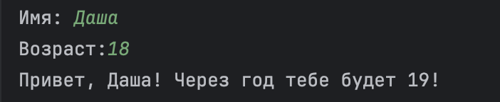
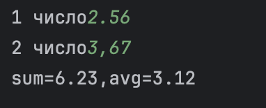
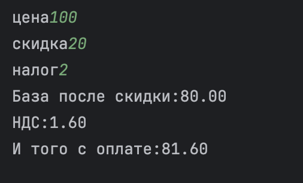
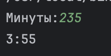
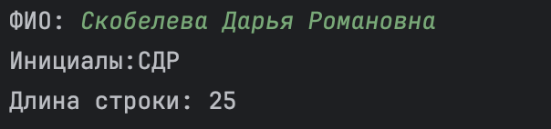

# Лабораторная работа 1 
## Задание 1

``` name=input('Имя:')
age=int(input('Возраст:'))
print(f'Привет,{name}! Через год тебе будет {age+1}!') 
```

## Задание 2

``` a=float(input('1 число').replace(',','.'))
b=float(input('2 число').replace(',','.'))
sum=a+b
avg=sum/2
print(f'sum={sum:.2f},avg={avg:.2f}')

```

## Задание 3

``` price=float(input('цена'))
discount=float(input('скидка'))
vat=float(input('налог'))
base = price * (1 - discount/100)
vat_amount = (base * (vat/100))
total = (base + vat_amount)
print(f'База после скидки:{base:.2f}')
print(f'НДС:{vat_amount:.2f}')
print(f'И того с оплате:{total:.2f}')
```

## Задание 4

``` min=int(input('Минуты:'))
hour=min//60
mins=min%60
print(f'{hour}:{mins}')
```

## Задание 5

```name=input("ФИО: ").strip()
name=input("ФИО: ")
inc=''
for i in name.split():
    inc+=(i)[0]

print(f'Инициалы:{inc}')
print(f'Длина строки: {len(name)}')
```

