# Лабораторная работа 1 
## Задание 1

``` name=input('Имя:')
age=int(input('Возраст:'))
print(f'Привет,{name}! Через год тебе будет {age+1}!') 
```
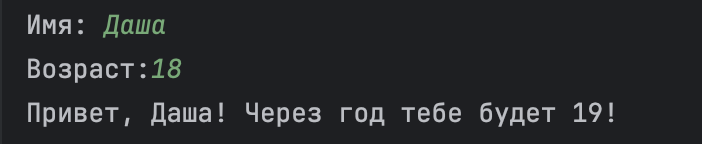
## Задание 2

``` a=float(input('1 число').replace(',','.'))
b=float(input('2 число').replace(',','.'))
sum=a+b
avg=sum/2
print(f'sum={sum:.2f},avg={avg:.2f}')

```
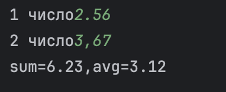
## Задание 3

``` price=float(input('цена'))
discount=float(input('скидка'))
vat=float(input('налог'))
base = price * (1 - discount/100)
vat_amount = (base * (vat/100))
total = (base + vat_amount)
print(f'База после скидки:{base:.2f}')
print(f'НДС:{vat_amount:.2f}')
print(f'И того с оплате:{total:.2f}')
```
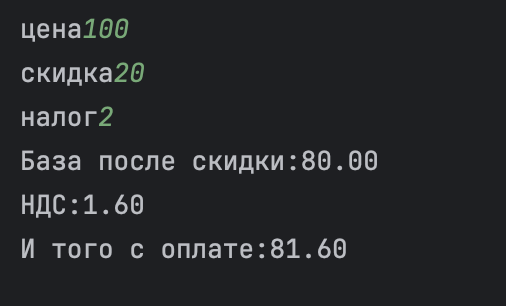
## Задание 4

``` min=int(input('Минуты:'))
hour=min//60
mins=min%60
print(f'{hour}:{mins}')
```
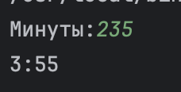
## Задание 5

```name=input("ФИО: ")
inc=''
len_name=0
name_list=[]
for i in name.split():
    inc+=(i)[0]
    name_list.append(i)
for i in name_list:
    len_name= len_name+len(i)+1


print(f'Инициалы:{inc}')
print(f'Длина строки: {len_name-1}')
```
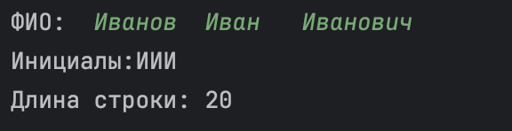

# Лабораторная работа 2
## Задание 1

```
from  itertools import *
def min_max(nums: list[float | int]) -> tuple[float | int, float | int]:
    if not nums:
        raise ValueError('ValueError')
    return (min(nums), max(nums))

def  unique_sorted(nums: list[float | int]) -> list[float | int]:
    return list(sorted(set(nums)))

def flatten(mat: list[list | tuple]) -> list:
    for i in mat:
        if type(i) == str:
            return TypeError('TypeError')
        if len(i)==0:
            del(i)
    return list(chain(*mat))


print(min_max([1.5, 2, 2.0, -3.1]))
print(unique_sorted([1,4,1,1,-6,-6,0.8]))
print(flatten([[1,4,1,1],[-6,-6,0.8]]))
```

## Задание B

```
def transpose(mat: list[list[float | int]]) -> list[list]:
    if len(mat)>1:
        for lines in range(1,len(mat)):
            if len(mat[0])!=len(mat[lines]):
                ans = 'ValueError'
            else: ans = [list(row) for row in zip(*mat)]
    else: ans = [list(row) for row in zip(*mat)]
    return ans
print(transpose([[1, 2, 3]] ))

def row_sums(mat: list[list[float | int]]) -> list[float]:
    ans=[]
    if len(mat)>1:
        for lines in range(1,len(mat)):
            if len(mat[0])!=len(mat[lines]):
                ans = 'ValueError'
            else:
                for lines in range(len(mat)):
                    ans.append(sum(mat[lines]))
    return ans
print(row_sums([[-1, 1], [10, -10]]))

def col_sums(mat: list[list[float | int]]) -> list[float]:
    ans=[]
    for lines in range(len(mat)):
        if len(mat[0])!=len(mat[lines]):
            raise 'ValueError'
            break
    for colums in range(len(mat[0])):
        sum = 0
        for lines in range(len(mat)):
                    sum += mat[lines][colums]
        ans.append(sum)
    return ans

print(col_sums([[1, 2, 3], [4, 5, 6]]))

```
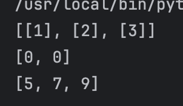
## Задание C

```
def format_record(rec: tuple[str, str, float]) -> str:

    for date in range(len(rec)):
        if len(str(rec[date])) == 0 or len(rec)!=3:
            raise 'ValueError'
    fin_name=[]
    for inc in rec[0].split():
        fin_name.append(inc.title())
    fin_name_st=f'{fin_name[0]} '
    sur_name_st=''
    for n in range(1,len(fin_name)):
        sur_name_st+=f'{fin_name[n][0]}.'
    if float(rec[2])>5.0:
        raise 'ValueError'
    gpa=float(rec[2])
    group=rec[1].strip()
    return f'{fin_name_st+ sur_name_st}, гр. {group}, GPA {gpa:.2f}'

print(format_record(("  сидорова  анна   сергеевна ", "ABB-01", 3.999)))
```
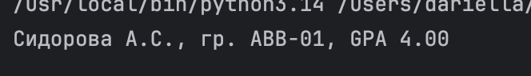

# Лабораторная работа 3 
## Цель работы
Нормализовать текст, аккуратно токенизировать, посчитать частоты слов и вывести топ-N слов.

## Задание A

``` 
import re

pattern = r'\w+(?:-\w+)*'
def normalize(text: str, *, casefold: bool = True, yo2e: bool = True) -> str:
    if casefold: text = text.lower()
    if yo2e: text = text.replace("ё","е")
    #text = re.findall(pattern, text)
    result = re.sub(r'\s+', ' ', text).strip()

    return result

print(normalize("ПрИвЕт\nМИр\t"))

def tokenize(text: str) -> list[str]:
    text=normalize(text)
    return re.findall(pattern, text)

print(tokenize("emoji 😀 не слово"))

def count_freq(tokens: list[str]) -> dict[str, int]:
    counts: dict[str, int] = {}
    for token in tokens:
        counts[token] = counts.get(token, 0) + 1
    return counts
print(count_freq(["a","b","b","b","a","c","b","a"]))

def top_n(freq: dict[str, int], n: int = 5) -> list[tuple[str, int]]:
    return sorted(freq.items(), key=lambda x: x[1], reverse=True)[:n]
print(top_n(count_freq(["a","b","a","c","b","a"]),n=5))
```
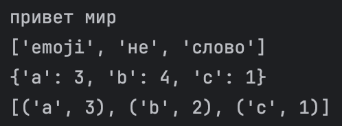
## Задание B

```
import sys
import os


sys.path.append(os.path.join(os.path.dirname(__file__), '..', 'lib'))

from text import normalize, top_n,tokenize, count_freq

inf=input("")
print(f'Всего слов: {len(tokenize(inf))}')
print(f'Уникальных слов: {len(count_freq((tokenize(inf))))}')
print('Топ-5:')
for world,count in top_n(count_freq((tokenize(inf))))[:5]:
     print(f'{world}: {count}')

```
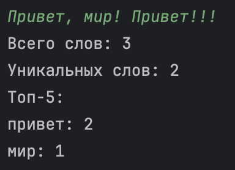

# Лабораторная работа 4 
## Цель работы
закрепить работу с файлами (чтение/запись, кодировки), автоматизировать сбор статистики по словам и выгружать её в CSV.

## Задание A

``` 
from pathlib import Path
import csv
from typing import Iterable, Sequence
import sys
import os
sys.path.append(os.path.join(os.path.dirname(__file__), '..', 'lib'))
from text import normalize, tokenize
def read_text(path: str | Path, encoding: str = "utf-8") -> str:
    path = Path(path)
    try:
         open(path, encoding=encoding)
    except UnicodeDecodeError:
        print("UnicodeDecodeError")
    except FileNotFoundError:
        print("FileNotFoundError")
    return path.read_text(encoding=encoding)
    raise UnicodeDecodeError
    raise FileNotFoundError

def write_csv(rows: Iterable[Sequence], path: str | Path,
              header: tuple[str, ...] | None = None) -> None:
    p = Path(path)
    rows = list(rows)

    with p.open("w", newline="", encoding="utf-8") as f:
        w = csv.writer(f)
        if rows:
            first_len = len(rows[0])
            for i, row in enumerate(rows):
                if len(row) != first_len:
                    raise ValueError
        if header is not None:
            w.writerow(header)
        for r in rows:
            w.writerow(r)

from collections import Counter

def frequencies_from_text(text: str) -> dict[str, int]:
    from lib.text import normalize, tokenize  # из ЛР3
    tokens = tokenize(normalize(text))
    return Counter(tokens)  # dict-like

def sorted_word_counts(freq: dict[str, int]) -> list[tuple[str, int]]:
    return sorted(freq.items(), key=lambda kv: (-kv[1], kv[0]))

```
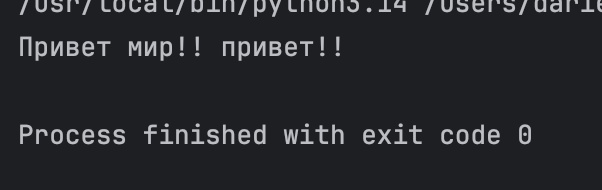
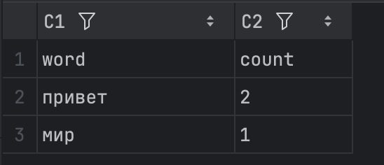
## Задание B

```
import sys
import os

from src.lib.text import top_n

sys.path.append(os.path.join(os.path.dirname(__file__), '..', 'lib'))
sys.path.append(os.path.join(os.path.dirname(__file__), '..', '..'))
from io_txt_csv import read_text, write_csv, frequencies_from_text
from text import normalize, top_n,tokenize, count_freq

txt = read_text("/Users/dariella/Desktop/python_labs/data/lab04/test.txt")
norm=normalize(txt)
token=tokenize(norm)
counts=count_freq(token)
top=top_n(counts)


write_csv( top, "/Users/dariella/Desktop/python_labs/data/lab04/check2.csv",header=("word", "count"))

print(f"Всего слов: {len(token)}")
print(f'Уникальных слов:{len(counts)}')
print('Топ-5:')
for world,count in top[:5]:
     print(f'{world}: {count}')

```


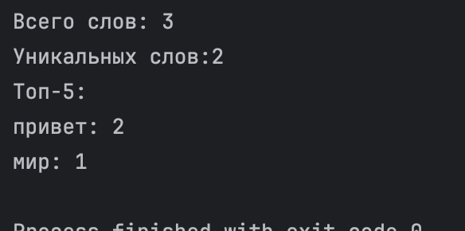

# Лабораторная работа 5 
## Цель работы
Разобраться с форматом JSON, сериализацией/десериализацией и табличными конвертациями.

## Задание A

``` 
from pathlib import Path
import json, csv

def json_to_csv(json_path: str, csv_path: str) -> None:
    path = Path(json_path)
    if not path.exists():
        raise FileNotFoundError("FileNotFoundError")
    with path.open(encoding="utf-8") as f:
        data = json.load(f)
    if not isinstance(data, list) or not all(isinstance(i, dict) for i in data):
        raise ValueError("ValueError")
    output = Path(csv_path)
    with output.open("w", encoding="utf-8", newline="") as f:
        writer = csv.DictWriter(f, fieldnames=data[0].keys())
        writer.writeheader()
        writer.writerows(data)


json_to_csv("/Users/dariella/Desktop/python_labs/data/lab05/samples/test.json","/Users/dariella/Desktop/python_labs/data/lab05/out/people_from_json.csv")

def csv_to_json(csv_path: str, json_path: str) -> None:
    path = Path(csv_path)
    if not path.exists():
        raise FileNotFoundError("FileNotFoundError")
    with path.open(encoding="utf-8") as f:
        reader = csv.DictReader(f)
        data = list(reader)

    '''if not isinstance(data, list) or not all(isinstance(i, dict) for i in data):
        raise ValueError("ValueError")'''
    output = Path(json_path)
    output.parent.mkdir(parents=True, exist_ok=True)


    with output.open("w", encoding="utf-8") as f:
        json.dump(data, f, ensure_ascii=False, indent=4)

csv_to_json('/Users/dariella/Desktop/python_labs/data/lab05/samples/test.csv', "/Users/dariella/Desktop/python_labs/data/lab05/out/test_from_csv.json")


```
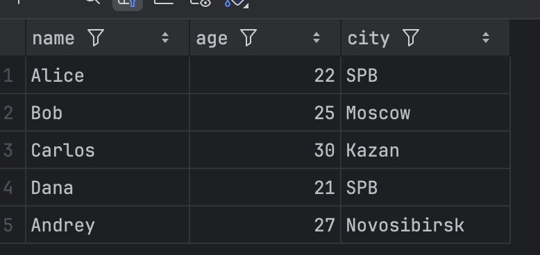
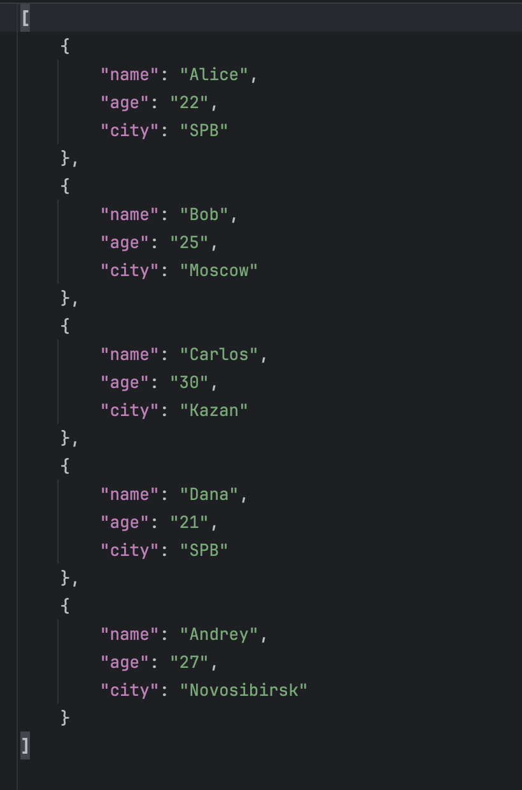
## Задание B

```
from openpyxl import Workbook
import csv
from pathlib import Path

def csv_to_xlsx(csv_path: str, xlsx_path: str) -> None:
    if not csv_path.lower().endswith(".csv"):
        raise ValueError("ValueError")
    if not xlsx_path.lower().endswith(".xlsx"):
        raise ValueError("ValueError")
    path = Path(csv_path)
    if not path.exists():
        raise FileNotFoundError("FileNotFoundError")
    wb = Workbook()
    ws = wb.active
    ws.title = "Sheet1"
    rows_added = 0
    try:
        with path.open(encoding="utf-8") as f:
            reader = csv.reader(f)
            for row in reader:
                ws.append(row)
                rows_added += 1
    except UnicodeDecodeError:
        raise ValueError("ValueError")

    if rows_added == 0:
        raise ValueError("ValueError")


    output = Path(xlsx_path)
    output.parent.mkdir(parents=True, exist_ok=True)

    wb.save(output)


csv_to_xlsx("/Users/dariella/Desktop/python_labs/data/lab05/samples/cities.csv","/Users/dariella/Desktop/python_labs/data/lab05/out/test_from_csv.xlsx")

```
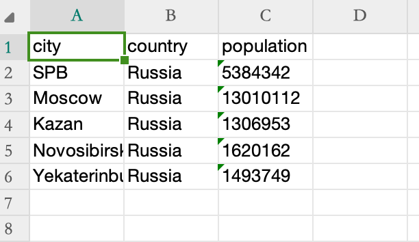


