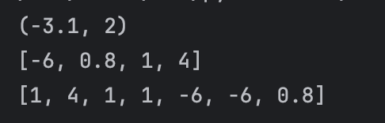

# Лабораторная работа 1 
## Задание 1

``` name=input('Имя:')
age=int(input('Возраст:'))
print(f'Привет,{name}! Через год тебе будет {age+1}!') 
```

## Задание 2

``` a=float(input('1 число').replace(',','.'))
b=float(input('2 число').replace(',','.'))
sum=a+b
avg=sum/2
print(f'sum={sum:.2f},avg={avg:.2f}')

```

## Задание 3

``` price=float(input('цена'))
discount=float(input('скидка'))
vat=float(input('налог'))
base = price * (1 - discount/100)
vat_amount = (base * (vat/100))
total = (base + vat_amount)
print(f'База после скидки:{base:.2f}')
print(f'НДС:{vat_amount:.2f}')
print(f'И того с оплате:{total:.2f}')
```

## Задание 4

``` min=int(input('Минуты:'))
hour=min//60
mins=min%60
print(f'{hour}:{mins}')
```

## Задание 5

```name=input("ФИО: ")
inc=''
len_name=0
name_list=[]
for i in name.split():
    inc+=(i)[0]
    name_list.append(i)
for i in name_list:
    len_name= len_name+len(i)+1


print(f'Инициалы:{inc}')
print(f'Длина строки: {len_name-1}')
```


# Лабораторная работа 2
## Задание 1

```
from  itertools import *
def min_max(nums: list[float | int]) -> tuple[float | int, float | int]:
    if not nums:
        raise ValueError('ValueError')
    return (min(nums), max(nums))

def  unique_sorted(nums: list[float | int]) -> list[float | int]:
    return list(sorted(set(nums)))

def flatten(mat: list[list | tuple]) -> list:
    for i in mat:
        if type(i) == str:
            return TypeError('TypeError')
        if len(i)==0:
            del(i)
    return list(chain(*mat))


print(min_max([1.5, 2, 2.0, -3.1]))
print(unique_sorted([1,4,1,1,-6,-6,0.8]))
print(flatten([[1,4,1,1],[-6,-6,0.8]]))
```

## Задание B

```
def transpose(mat: list[list[float | int]]) -> list[list]:
    if len(mat)>1:
        for lines in range(1,len(mat)):
            if len(mat[0])!=len(mat[lines]):
                ans = 'ValueError'
            else: ans = [list(row) for row in zip(*mat)]
    else: ans = [list(row) for row in zip(*mat)]
    return ans
print(transpose([[1, 2, 3]] ))

def row_sums(mat: list[list[float | int]]) -> list[float]:
    ans=[]
    if len(mat)>1:
        for lines in range(1,len(mat)):
            if len(mat[0])!=len(mat[lines]):
                ans = 'ValueError'
            else:
                for lines in range(len(mat)):
                    ans.append(sum(mat[lines]))
    return ans
print(row_sums([[-1, 1], [10, -10]]))

def col_sums(mat: list[list[float | int]]) -> list[float]:
    ans=[]
    for lines in range(len(mat)):
        if len(mat[0])!=len(mat[lines]):
            raise 'ValueError'
            break
    for colums in range(len(mat[0])):
        sum = 0
        for lines in range(len(mat)):
                    sum += mat[lines][colums]
        ans.append(sum)
    return ans

print(col_sums([[1, 2, 3], [4, 5, 6]]))

```

## Задание C

```
def format_record(rec: tuple[str, str, float]) -> str:

    for date in range(len(rec)):
        if len(str(rec[date])) == 0:
            raise 'ValueError'
    fin_name=[]
    for inc in rec[0].split():
        fin_name.append(inc.title())
    fin_name_st=f'{fin_name[0]} '
    sur_name_st=''
    for n in range(1,len(fin_name)):
        sur_name_st+=f'{fin_name[n][0]}.'
    if float(rec[2])>5.0:
        raise 'ValueError'
    gpa=float(rec[2])
    group=rec[1].strip()
    return f'{fin_name_st+ sur_name_st}, гр. {group}, GPA {gpa:.2f}'

print(format_record(("  сидорова  анна   сергеевна ", "ABB-01", 3.999)))
```


